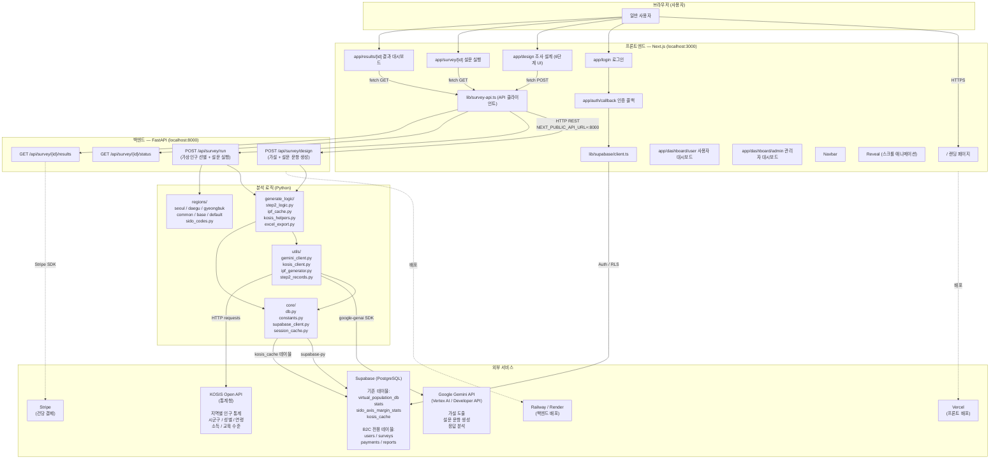
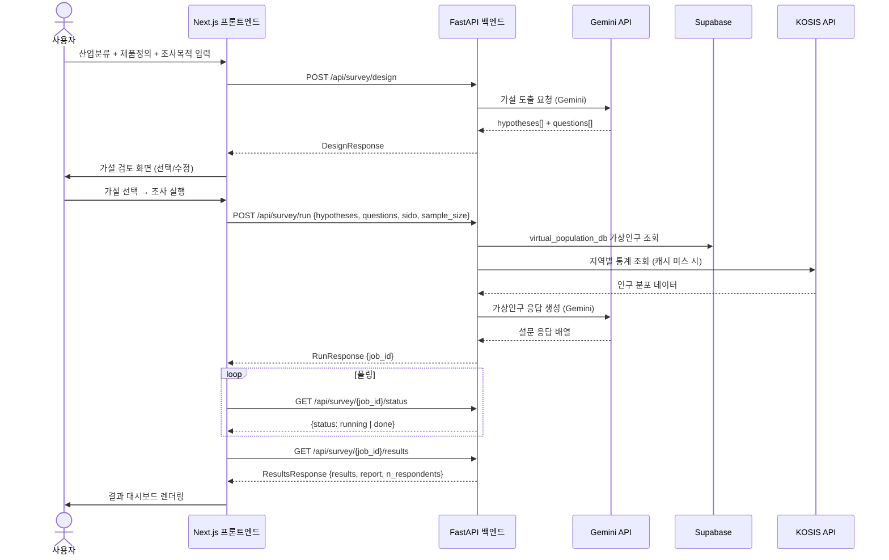

# 시스템 아키텍처 — Market Research B2C

## 전체 구성



---

## 데이터 흐름 — 조사 설계 ~ 결과



---

## 폴더 구조

```
market_research_b2c_starter/
│
├── frontend/                    ← Next.js 15 (App Router)
│   ├── app/
│   │   ├── page.tsx             - 랜딩 페이지
│   │   ├── login/page.tsx       - Supabase Auth 로그인
│   │   ├── auth/callback/       - OAuth 콜백
│   │   ├── design/page.tsx      - 6단계 조사 설계 UI
│   │   ├── survey/[id]/         - 설문 실행
│   │   ├── results/[id]/        - 결과 대시보드
│   │   └── dashboard/
│   │       ├── user/            - 사용자 대시보드
│   │       └── admin/           - 관리자 대시보드
│   ├── components/
│   │   ├── Navbar.tsx
│   │   └── Reveal.tsx
│   └── lib/
│       ├── survey-api.ts        - 백엔드 HTTP 클라이언트
│       └── supabase/client.ts   - Supabase 브라우저 클라이언트
│
├── core/                        ← 백엔드 공통 레이어
│   ├── constants.py             - 시도 마스터, 캐시 TTL 등
│   ├── db.py                    - Supabase DB 레이어 (virtual_population_db 청크 관리)
│   ├── supabase_client.py       - Supabase 클라이언트 초기화
│   └── session_cache.py         - 세션 캐시
│
├── generate_logic/              ← 가상인구 생성 핵심 로직
│   ├── step2_logic.py           - 2단계 대입 로직 (IPF 기반)
│   ├── ipf_cache.py             - IPF 결과 캐시
│   ├── kosis_helpers.py         - KOSIS 데이터 변환
│   └── excel_export.py          - 엑셀 내보내기
│
├── regions/                     ← 지역별 가상인구 설정
│   ├── base.py / common.py
│   ├── seoul.py / daegu.py / gyeongbuk.py
│   └── sido_codes.py
│
├── utils/                       ← 외부 서비스 클라이언트
│   ├── gemini_client.py         - Gemini AI (가설 생성, 응답 분석)
│   ├── kosis_client.py          - KOSIS Open API 연동
│   ├── ipf_generator.py         - IPF(반복비례맞춤) 인구 생성
│   └── step2_records.py         - 2단계 기록 관리
│
└── requirements.txt             ← Python 의존성
    (streamlit, supabase, google-genai, pandas, ipfn, pymc 등)
```

---

## 기술 스택 요약

| 계층 | 기술 | 용도 |
|------|------|------|
| 프론트엔드 | Next.js 15 (React, TypeScript) | B2C SaaS UI, App Router |
| 스타일링 | Tailwind CSS | 유틸리티 기반 UI |
| 백엔드 | FastAPI (Python) | REST API 서버 |
| AI | Google Gemini (google-genai) | 가설 도출, 설문 생성, 응답 분석 |
| 데이터베이스 | Supabase (PostgreSQL) | 가상인구 DB, 인증, 캐시 |
| 인구 통계 | KOSIS Open API | 지역별 실제 인구 분포 |
| 가상인구 생성 | IPF (iterative proportional fitting) | 통계 마진 맞춤 인구 합성 |
| 결제 | Stripe | 건당 결제 |
| 프론트 배포 | Vercel | Next.js 최적화 호스팅 |
| 백엔드 배포 | Railway / Render | Python 서버 호스팅 |

---

## 환경 변수

### 프론트엔드 (`frontend/.env.local`)
```
NEXT_PUBLIC_SUPABASE_URL=<supabase_project_url>
NEXT_PUBLIC_SUPABASE_ANON_KEY=<supabase_anon_key>
NEXT_PUBLIC_API_URL=http://localhost:8000
```

### 백엔드 (`.env` 또는 Streamlit Secrets)
```
SUPABASE_URL=<supabase_project_url>
SUPABASE_KEY=<supabase_service_key>
GEMINI_API_KEY=<google_ai_api_key>
KOSIS_API_KEY=<kosis_open_api_key>
```
